# Blocking JavaScript without Breaking the Web
`Blocking JavaScript without Breaking the Web
Abdul Haddi Amjad, Zubair Shafiq, Muhammad Ali Gulzar
Proceedings on Privacy Enhancing Technologies Symposium (PETS), 2023`

The ArXiv version of the manuscript is avaibable at : [Blocking JS without Breaking the Web](https://arxiv.org/pdf/2302.01182.pdf)

This repository provides the complete instrumentation to evaluate different JS blocking strategies proposed in the paper. 

## Methodology
In this paper we propose three step process:
1. **JavaScript Corpus Collection:**  In process we crawl landing pages of websites using chrome extension to capture network requests and its associated call stacks. Then, each request is labeled using Filter Lists.

2. **Localizing Tracking and Functional JS Code:** We use previously labelled dataset to generate spectra of entites (script and methods) using spectra-based fault localization.
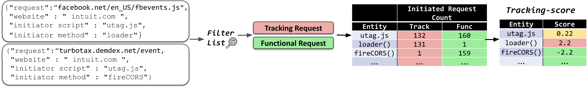

3. **JS Blocking Impact Analysis:** Eventually we use the annotated spectra of entities to try different JS blocking strategies. 
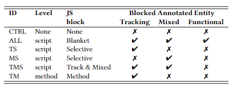

4. We report (1) network request count and (2) missing functional tag URLs as a breakage metric.
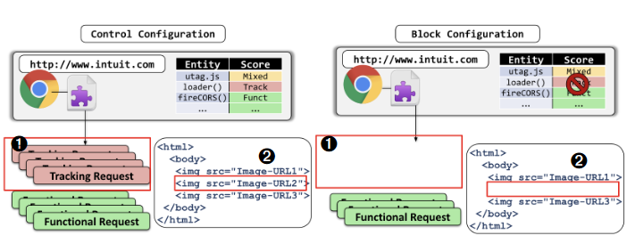

## Installation

#### 1. Clone the the github repository
`git clone https://github.com/hadiamjad/Blocking-JavaScript-without-Breaking-the-Web.git` and move in the directory using `cd` command

#### 2. Build the docker using Dockerfile

- This command `docker build -t blockingjs .` will build docker image using Dockerfile.
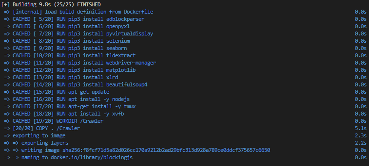

- Run the docker image using `docker run -it blockingjs`
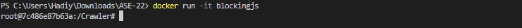

- Try running `ls` command in the docker terminal and it will list all the files inside this repository.

#### 3. OPTIONAL: Tmux session (You can skip this step if you are already familiar with tmux)
In this tutorial we will be using tmux sessions to create server and client sessions for testing.
Some important commands:
- To create new session `tmux new -s {session-name}`
- To leave existing session `Cntrl + b` followed by `d`
- To join existing session`tmux a -t {session-name}`

### 4. Running above methodology

##### Step 1: Run servers for all configurations
> Make sure your docker build was successful and you are inside docker container after running `step 2` and `ls` command shows the content of this repository.

- Create new tmux session for running all server `tmux new -s server`. This will automatically join the session as well.

- Run the following command `bash server.sh` this will start all servers for different configurations.
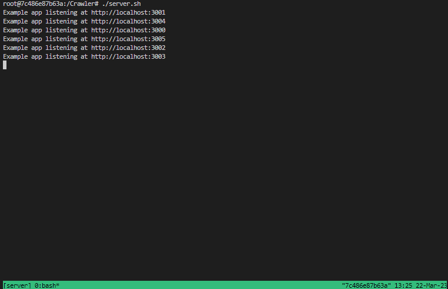

- Leave the `server` session using `Cntrl + b` followed by `d`.

##### Step 2: Running JavaScript Corpus Collection & Localizing Tracking and Functional JS Code
- Create new tmux session for running **JavaScript Corpus Collection & Localizing Tracking and Functional JS Code** using this `tmux new -s client` command. This will automatically join the session as well.

- Now run `cd Control/webpage-crawler-extension` and then once you are inside the directory, simply run `bash client.sh` to start crawler.  

It involves crawlling the landing pages of 10 sample websites listed in 'Control\webpage-crawler-extension\csv\test.csv', then label it using filter lists, print the number of tracking and functional requests count in control setting, eventually run SBFL.py to generate tracking score for other configurations.

Once all steps are complete the output will look like this:
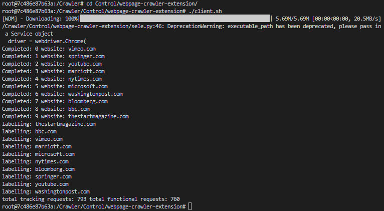

##### Step 3: Running JS Blocking Impact Analysis
- Using the same tmux session i.e `client`, you can test other configurations. 

###### Testing `ALL` configuration
- Staying inside `client` session.
- Go inside `cd ../../ALL/webpage-crawler-extension` and run `bash client.sh`.

 This will crawl the landing pages of websites(from previous step) in ALL setting(all tracking, functional and mixed scripts are blocked). This step will crawl the websites, then label it using filter lists, print the number of tracking and functional requests count in ALL setting. 

> Note last two lines report the raw numbers (1) network request count and (2) missing functional tag URLs as a breakage metric. These numbers may vary from screenshot due to dynamic nature of website

The output will look like this(number may vary due to dynamic nature of websites):
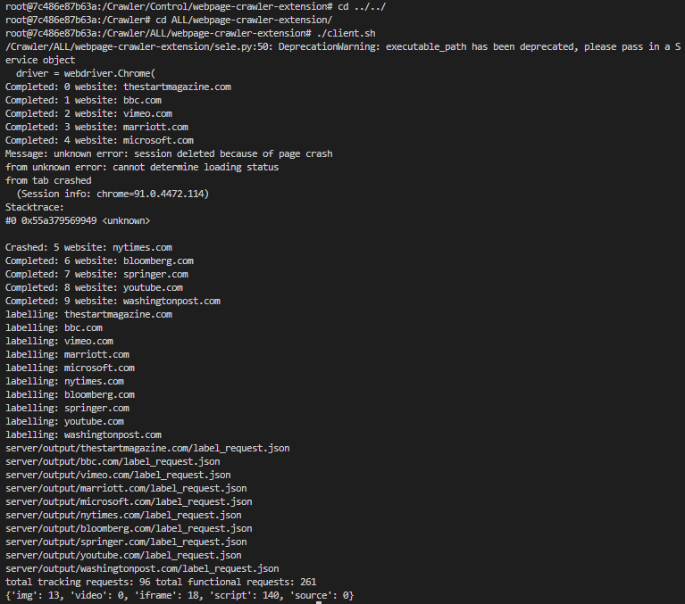

###### Testing `TS` configuration
- Staying inside `client` session.

- Go inside `cd ../../TS/webpage-crawler-extension` and run `bash client.sh`.

 This will crawl the landing pages of websites(from Control setting) using chrome extension configured with TS setting where all tracking scripts are blocked. Then label it using filter lists, and print the number of tracking and functional requests count in TS setting. 

> Note last two lines report the raw numbers of (1) network request count and (2) missing functional tag URLs as a breakage metric. These numbers may vary from screenshot due to dynamic nature of website

The output will look like this(number may vary due to dynamic nature of websites):
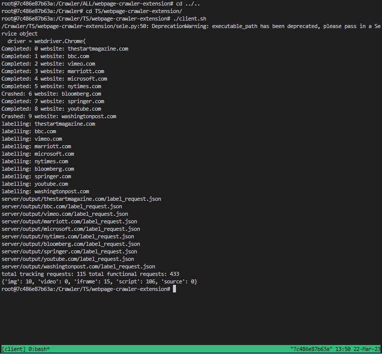

###### Testing `MS` configuration
- Staying inside `client` session.
- Go inside `cd ../../MS/webpage-crawler-extension` and run `bash client.sh`.

 This will crawl the landing pages of websites(from Control setting) using chrome extension configured with MS setting where all mixed scripts are blocked. Then label it using filter lists, and print the number of tracking and functional requests count in MS setting. 

> Note last two lines report the raw numbers of (1) network request count and (2) missing functional tag URLs as a breakage metric. These numbers may vary from screenshot due to dynamic nature of website.

The output will look like this(number may vary due to dynamic nature of websites):

###### Testing `TMS` configuration
- Staying inside `client` session.
- Go inside `cd ../../TMS/webpage-crawler-extension` and run `bash client.sh`.

 This will crawl the landing pages of websites(from Control setting) using chrome extension configured with TMS setting where all tracking scripts and mixed scripts are blocked. Then label it using filter lists, and print the number of tracking and functional requests count in TMS setting. 

> Note last two lines report the raw numbers of (1) network request count and (2) missing functional tag URLs as a breakage metric. These numbers may vary from screenshot due to dynamic nature of website

The output will look like this(number may vary due to dynamic nature of websites):
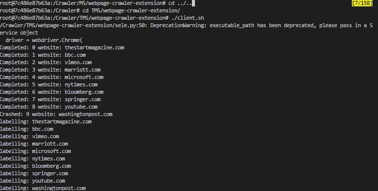

###### Testing `TM` configuration
- Staying inside `client` session.
- Go inside `cd ../../TM/webpage-crawler-extension` and run `bash client.sh`.

 This will crawl the landing pages of websites(from Control setting) using chrome extension configured with TM setting where all tracking methods are blocked. Then label it using filter lists, and print the number of tracking and functional requests count in TM setting. 

> Note last two lines report the raw numbers of (1) network request count and (2) missing functional tag URLs as a breakage metric. These numbers may vary from screenshot due to dynamic nature of website

The output will look like this(number may vary due to dynamic nature of websites):
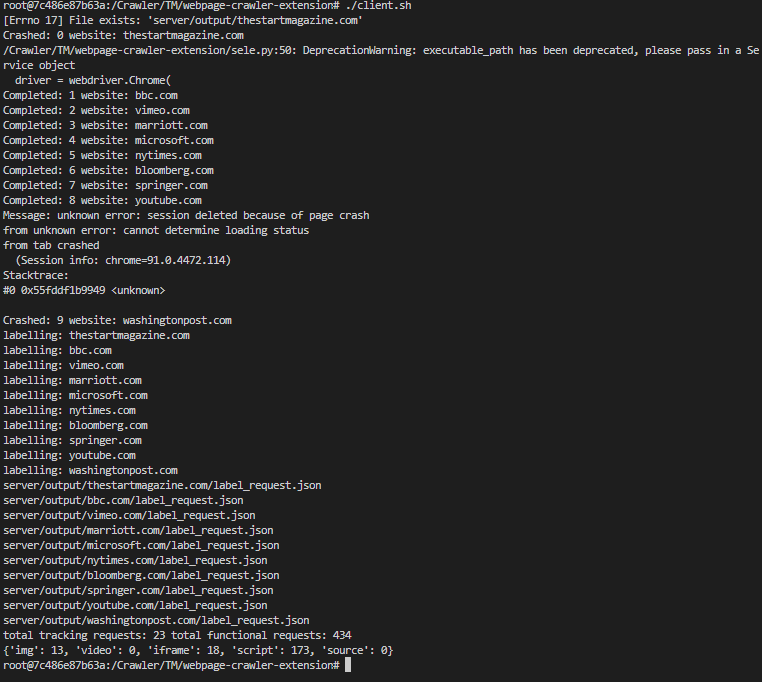

### 5. Generating figures
#### Generating `Number of Request` figures for all RQ's
- You can simply run the following command: `python -W ignore requestCountBarPlots.py {Configuration 1} {Configuration 2}` --- here `{Configuration 1}`and `{Configuration 2}` are placeholders. For example, if you want to create for RQ4 you can run following command:
 `python -W ignore requestCountBarPlots.py TMS TM`
- This will generate plot pdf in `Figures/BarPlot.pd` 
> Note you can try TS MS for RQ2

#### Generating `% Reduction` figures for all RQ's
- You can simply run the following command: `python -W ignore reductionBarPlots.py {Configuration 1} {Configuration 2}` --- here `{Configuration 1}` and `{Configuration 2}` are placeholders. For example, if you want to create for RQ4 you can run following command:
 `python -W ignore requestCountBarPlots.py TMS TM`
- This will generate plot pdf in `Figures/BarPlot.pd` 

#### Generating `Distribution Plots` figures for all RQ's
- You can simply run the following command: `python -W ignore requestDistriution.py {Configuration 1}` --- here `{Configuration 1}` is placeholders. For example, if you want to create for RQ2 you can run following command:
 `python -W ignore requestCountBarPlots.py TMS`
- This will generate plot pdf in `Figures/BarPlot.pd` 

#### Retrieving Figures folder on local to view it
You can run the following command in LOCAL REPOSITORY SHELL to copy the folder to local to view it using this command
`docker cp {container_id}:/Crawler/Figures .`. For example in my case the container id is located on the docker shell
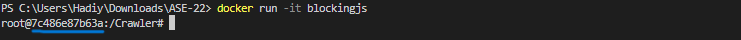

`docker cp  7c486e87b63a:/Crawler/Figures .`
